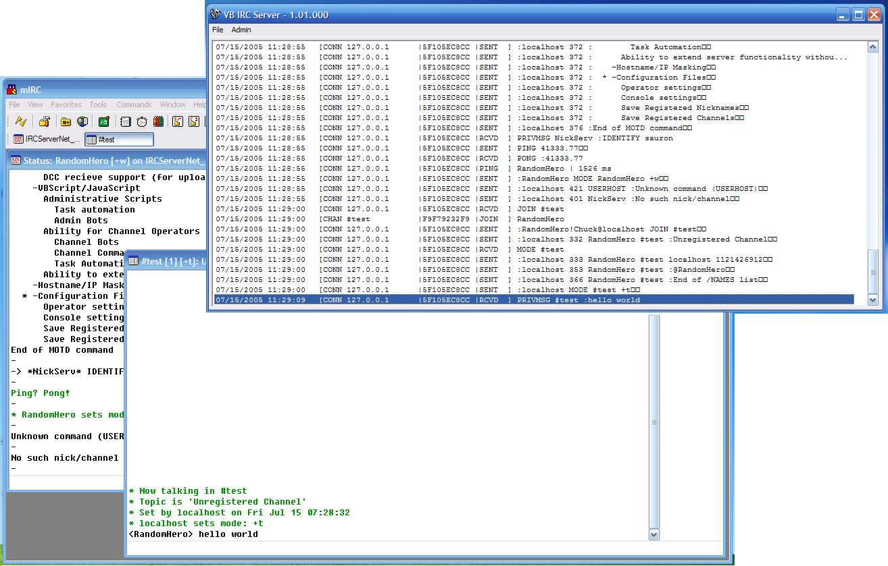



## IRC Server

### Description

This is an IRC Server that is written entirely in VB 6.  It is broken up into three parts: Server Core, Winsocket API Dll, Timer API Dll.  This is program is mostly complete, and can be used. Features that are not done are listed in the ..\Current 1.0.0\Config\MOTD.txt

This server program utilizes many advanced fucntions such as MS XML for configuration storage, call stacking, DNS reverse name lookups, etc. I'm sorry if most of this code isn't commented, but I spent alot of time on this. I'm aiming to win the code of the month or something with this, so please vote! I do believe that this is the best submission in a long time here. If you use my code, I would appreciate an email letting me know what code you're using and for what. I'm always curious as to what my code can be used for, and what people think of it.
 
### More Info
 

             |
---                |---
**Submitted On**   |2005-07-14 00:33:16
**By**             |[Chuck Potalivo](https://github.com/Planet-Source-Code/PSCIndex/blob/master/ByAuthor/chuck-potalivo.md)
**Level**          |Advanced
**User Rating**    |4.8 (48 globes from 10 users)
**Compatibility**  |VB 6\.0
**Category**       |[Complete Applications](https://github.com/Planet-Source-Code/PSCIndex/blob/master/ByCategory/complete-applications__1-27.md)
**World**          |[Visual Basic](https://github.com/Planet-Source-Code/PSCIndex/blob/master/ByWorld/visual-basic.md)
**Archive File**   |[IRC\_Server1913077142005\.zip](https://github.com/Planet-Source-Code/chuck-potalivo-irc-server__1-61690/archive/master.zip)

